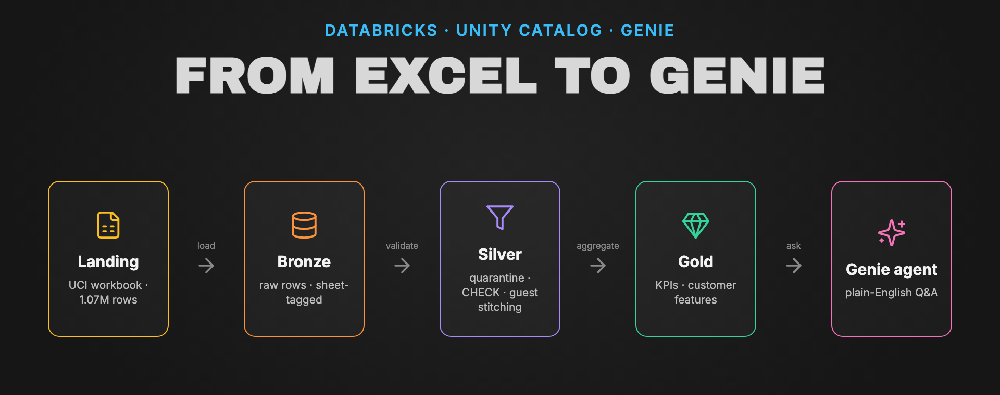
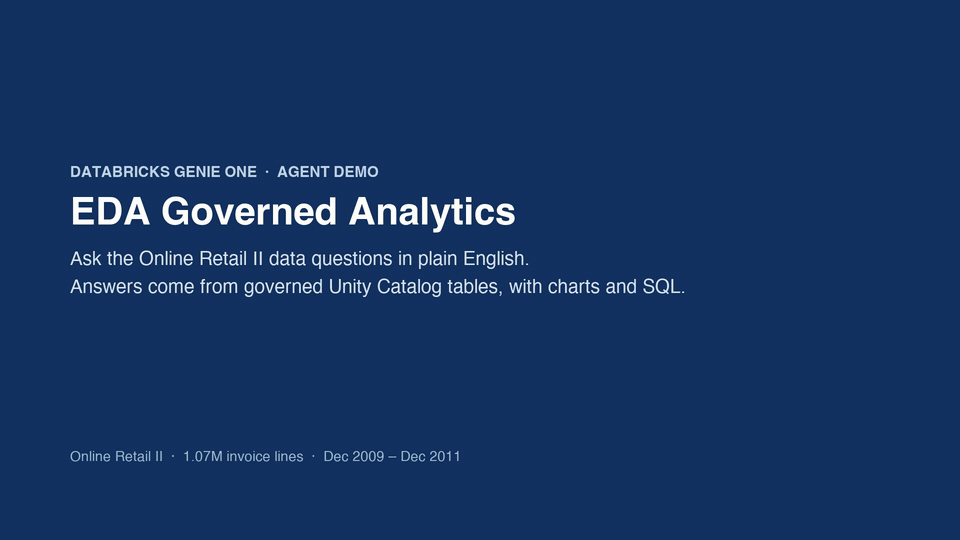
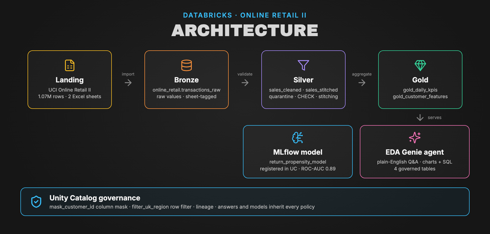

<div align="center">



# From Excel to Genie: a Databricks EDA & Lakehouse Blueprint

**1.07M retail transactions → governed Unity Catalog tables → plain-English answers from a Genie agent.**
Exploratory data analysis of UCI *Online Retail II*, taken all the way to production on Databricks.


[▶ **Watch the demo**](#-see-it-in-action) · [📊 **Open the presentation**](https://htmlpreview.github.io/?https://github.com/slysik/databricks-eda/blob/main/eda_online_retail_ii_presentation.html) · [📓 **Notebook**](eda-online-retail-gold-V1-2026-10-02%2017_48_41.ipynb) · [🧞 **Genie agent as code**](genie/eda_governed_gold_space.json) · [🏗️ **Architecture**](#️-architecture)

</div>

---

## 🎬 See it in action

[](https://github.com/slysik/databricks-eda/raw/main/demo/genie_agent_demo.mp4)

*The **EDA Governed Analytics** Genie agent (Databricks Genie One) answers two business questions with charts and the SQL behind them, from governed Unity Catalog tables. 36 s · ▶ [full-quality MP4](https://github.com/slysik/databricks-eda/raw/main/demo/genie_agent_demo.mp4)*

---

## 💡 What the data says

> **Sales look flat (+1.2% YoY), but two opposite stories hide underneath.**

| | | |
|:---:|:---:|:---:|
| **−2.8%**<br/>identified wholesale customers<br/><sub>units −10.8%, value per unit up</sub> | **+32.1%**<br/>no-customer-ID web channel<br/><sub>carries all of the net growth</sub> | **63.2%**<br/>of revenue from the top 10% of customers<br/><sub>Netherlands = 1 account (96%)</sub> |
| **36–38%**<br/>of annual sales land in Sep–Nov<br/><sub>the Christmas peak, both years</sub> | **0.89**<br/>ROC-AUC, return-propensity model<br/><sub>MLflow, registered in UC</sub> | **£0.00**<br/>difference between PySpark and Spark SQL<br/><sub>on every headline KPI</sub> |

### 🕵️ Data traps found (and why they matter)
* **The two Excel sheets overlap:** 22,523 rows (≈ £377k) from 1–9 Dec 2010 appear in both. Stack the sheets naively, as the popular Kaggle CSV does, and early December 2010 is counted twice.
* **Not every negative quantity is a return:** `C` invoices are cancellations, `A` invoices are bad-debt write-offs, and some lines are stock adjustments. Each needs different handling.
* **Missing customer IDs aren't random:** they cluster on batched web orders, effectively a separate sales channel.

---

## 🏗️ Architecture



<sub>Diagram source: [`assets/architecture.json`](assets/architecture.json), rendered with a small HTML-to-PNG diagram kit.</sub>

### What's under the hood
| Capability | How |
|---|---|
| **Dual-engine parity** | Every KPI is computed in both the PySpark DataFrame API and Spark SQL, then checked with a zero-tolerance assertion harness. |
| **Data quality & quarantine** | Delta `CHECK` constraints (`quantity != 0`, `price >= 0`); non-product codes (`POST`, `D`, `BANK CHARGES`, `AMAZONFEE`) go to an audit table without breaking ingestion. |
| **Customer identity stitching** | Guest checkouts are attributed using invoice timing, country and order velocity. |
| **Predictive ML** | A Random Forest return-propensity model on RFM features (**ROC-AUC 0.8899**), logged with MLflow and registered as `retail_prod.gold.return_propensity_model`. |
| **Governance** | A UC column mask hides `customer_id` from non-admin roles; a row filter scopes regions. Genie answers inherit both. |
| **Genie agent as code** | The space definition (tables, instructions, sample questions, example SQL) is in [`genie/`](genie/eda_governed_gold_space.json); notebook §14 recreates it. |

---

## 📂 What's in the repo

| File | What it is |
|---|---|
| 📓 [`eda-online-retail-gold-V1-…ipynb`](eda-online-retail-gold-V1-2026-10-02%2017_48_41.ipynb) | **Main notebook:** 28 cells covering EDA §1–7, the production extension §8–14 and Genie agent creation. Outputs are pre-rendered. |
| 🧾 [`eda-online-retail-gold-V1-…html`](eda-online-retail-gold-V1-2026-10-02%2017_48_41.html) | Executed Databricks run export (all charts and results). |
| 📊 [`eda_online_retail_ii_presentation.html`](https://htmlpreview.github.io/?https://github.com/slysik/databricks-eda/blob/main/eda_online_retail_ii_presentation.html) | Single-file executive presentation, built from the notebook run. |
| 🧮 [`eda_online_retail_ii_sql.py`](eda_online_retail_ii_sql.py) | SQL-first EDA notebook (Databricks source) behind the growth, concentration and retention figures. |
| 🧞 [`genie/eda_governed_gold_space.json`](genie/eda_governed_gold_space.json) | Genie agent definition, versioned with the code. |
| 🎬 [`demo/genie_agent_demo.mp4`](https://github.com/slysik/databricks-eda/raw/main/demo/genie_agent_demo.mp4) | 36-second captioned Genie demo. |
| 🛠️ [`build_presentation.py`](build_presentation.py) | Compiles the presentation from a notebook run export, so the report can't drift from the code. |
| 📋 [`eda_interview_exercise.md`](eda_interview_exercise.md) | The original brief. |

---

## 🚀 Quickstart

**In Databricks:** Workspace → Create → **Git folder** → `https://github.com/slysik/databricks-eda`, open the main notebook, attach **Serverless** compute and **Run all**. Or import just the `.ipynb` via Workspace → Import.

**Rebuild the presentation** from a notebook run export:
```bash
uv run --with markdown python build_presentation.py "eda-online-retail-gold-V1-2026-10-02 17_48_41.html" eda_online_retail_ii_presentation.html
```

---

## 🎯 Recommendations

1. **Formalize the web channel:** give unauthenticated web orders a proper digital journey (persistent guest sessions, email recapture) and capture a customer key.
2. **De-risk account concentration:** monitor order rhythm for the top wholesale accounts and act when one goes quiet.
3. **Act on return risk:** use the registered `return_propensity_model` to flag high-risk orders (>15%) at checkout.

---

<div align="center">

**Built by [@slysik](https://github.com/slysik)** on Databricks · Unity Catalog · Genie · MLflow · Delta Lake
Data: [UCI Online Retail II](https://archive.ics.uci.edu/dataset/502/online+retail+ii) (Dec 2009 – Dec 2011)

</div>
