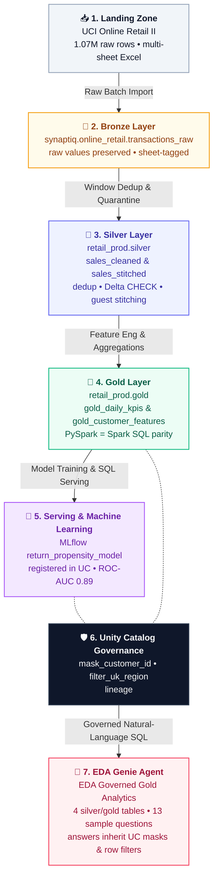

# Databricks EDA & Lakehouse Production Blueprint
### Online Retail II Transaction Analysis & Architecture

A dual-engine (**PySpark + Spark SQL**) exploratory data analysis with programmatic parity verification, extending to an enterprise Lakehouse blueprint featuring Gold medallion aggregates, MLflow predictive modeling, Unity Catalog governance, and Genie AI/BI self-service analytics.

---

## 🎬 Demo: EDA Genie Agent (36 s)

[](https://github.com/slysik/databricks-eda/raw/main/demo/genie_agent_demo.mp4)

*Asking the **EDA Governed Analytics** Genie agent (Databricks Genie One) two business questions. Answers come back as charts with the SQL behind them, from governed Unity Catalog tables. ▶ [Watch the full-quality MP4](https://github.com/slysik/databricks-eda/raw/main/demo/genie_agent_demo.mp4).*

---

## Executive Summary

Analyzing 1.07M raw transaction line items from a UK-based online gift retailer (Dec 2009 – Dec 2011). 

* **Headline Top-Line (+1.2% YoY):** Flat top-line growth hides two opposing dynamics:
  * **Identified Wholesale Accounts:** Fell **−2.8%** (units purchased dropped 10.8%, partially offset by higher ticket value per unit).
  * **Anonymous / Dotcom Web Channel:** Grew **+32.1%** and accounts for 100% of the retailer's net growth.
* **Volume Concentration & Seasonality:** 
  * Top 10% of customer accounts generate **63.2%** of revenue.
  * Q4 holiday rush (Sep–Nov) accounts for **~38%** of annual revenue.
  * Export markets are heavily concentrated in single corporate wholesale accounts (e.g., Netherlands = 1 customer driving 96% of sales).
* **Data Traps Discovered & Neutralized:**
  * **Sheet Overlap (1–9 Dec 2010):** 22,523 rows (~GBP 377k) were duplicated across annual sheets, inflating previously published Kaggle benchmarks.
  * **Cancellation Linkage:** Disentangled true returns (`C` prefix) from accounting adjustments (`A` prefix) and admin write-offs.

### Key Financials (Dual-Engine Parity Verified)

| Metric | PySpark | Spark SQL | Parity Status |
| :--- | :--- | :--- | :---: |
| **Gross Sales** | GBP 20,317,406.03 | GBP 20,317,406.03 | **PASS (Diff = 0.00)** |
| **Refunds & Cancellations** | GBP 1,462,424.18 | GBP 1,462,424.18 | **PASS (Diff = 0.00)** |
| **Net Revenue** | GBP 18,854,981.85 | GBP 18,854,981.85 | **PASS (Diff = 0.00)** |
| **Active Customer Accounts** | 5,942 | 5,942 | **PASS (Diff = 0.00)** |
| **Guest Checkout Share** | 16.3% | 16.3% | **PASS (Diff = 0.00)** |
| **Cleaned Line Items** | 1,033,034 | 1,033,034 | **PASS (Diff = 0.00)** |

---

## Production Blueprint & Lakehouse Architecture



**Live Genie agent:** [EDA Governed Gold Analytics](https://dbc-61514402-8451.cloud.databricks.com/genie/rooms/01f1be9f6999187ea0956f86f5fe7e9b?o=7474656067656578) (workspace access required) · definition in [`genie/eda_governed_gold_space.json`](genie/eda_governed_gold_space.json)


### Key Technical Capabilities

1. **Dual-Engine Mathematical Parity:**
   Every analytical figure and KPI is implemented in two independent engines (PySpark DataFrame API and Spark SQL dialect), then programmatically evaluated against a zero-tolerance assertion harness.
2. **Deterministic Data Quality & Quarantine:**
   Delta `CHECK` constraints prevent fatal anomalies (`quantity != 0`, `price >= 0`), while non-inventory service codes (`POST`, `D`, `BANK CHARGES`, `AMAZONFEE`) are isolated into an audit quarantine table without breaking ingestion pipelines.
3. **Customer Identity Stitching:**
   Heuristic attribution resolves unauthenticated guest checkouts by linking invoice temporal locality, country metadata, and order velocity to recover fractured customer journeys.
4. **Predictive Machine Learning (MLflow + UC):**
   A Random Forest Return Propensity classifier trained on RFM features achieves **0.8899 ROC-AUC**, fully logged with parameters and artifacts, and registered to Unity Catalog as `retail_prod.gold.return_propensity_model`.
5. **Unity Catalog Dynamic Governance:**
   Dynamic column masks (`MASK()` user-defined function) mask `customer_id` into `***MASKED***` for non-administrative roles while preserving complete operational utility.

---

## Deliverables & Repository Layout

| File | Description |
| :--- | :--- |
| **`eda-online-retail-gold-V1-2026-10-02 17_48_41.ipynb`** | **Interactive Jupyter Notebook:** 28 cells with gradient cards, pre-rendered outputs, and Genie Agent creation (§14). |
| **`eda_online_retail_ii_presentation.html`** | **Executive Presentation:** Standalone single-file HTML presentation in light tonal colors featuring the top-down Lakehouse architecture visual and live Genie verification. |
| **`genie/eda_governed_gold_space.json`** | **Genie Agent as Code:** Exported definition of the *EDA Governed Gold Analytics* space (tables, instructions, sample questions, example SQL). Recreate it with the Genie API or notebook §14. |
| **`eda-online-retail-gold-V1-2026-10-02 17_48_41.html`** | **Notebook Run Export:** Executed Databricks run; input to `build_presentation.py`. |
| **`eda_online_retail_ii_sql.py`** | **SQL EDA Notebook (Databricks source):** The SQL-first analysis behind the headline growth, concentration and retention figures. |
| **`demo/genie_agent_demo.mp4`** | **Genie Agent Demo Video:** 36-second captioned walkthrough of the agent answering questions with charts and SQL (GIF preview at the top of this README). |
| **`genie_one_eda.png`** | **Genie AI/BI Live Verification:** Screenshot of Databricks Genie Agent answering guest checkout revenue distribution over Gold tables. |
| **`build_presentation.py`** | **Report Compiler:** Builds the presentation directly from notebook execution models, ensuring report-to-code alignment. |

---

## Quickstart

### 1. Open in Databricks
This repo is linked as a Databricks **Git folder** at `/Workspace/Users/<you>/databricks-eda` (Workspace → Create → Git folder → `https://github.com/slysik/databricks-eda`). Or import a single notebook:

1. In your Databricks workspace, navigate to **Workspace**.
2. Click **Import** &rarr; select **`eda-online-retail-gold-V1-2026-10-02 17_48_41.ipynb`**.
3. Attach to any **Serverless Compute** or standard cluster (DBR 14.3+).
4. Run all cells or view in **Results only** mode for clean presentation display.

### 2. Run Presentation Compiler Locally
The analytical HTML presentation can be recompiled directly from the notebook run export:
```bash
uv run --with markdown python build_presentation.py "eda-online-retail-gold-V1-2026-10-02 17_48_41.html" eda_online_retail_ii_presentation.html
```

---

## Strategic Recommendations

1. **Formalize the Dotcom Channel:** Transition unauthenticated web orders to a dedicated digital brand journey with persistent guest sessions and targeted email recapture.
2. **Mitigate Account Concentration Risk:** Implement proactive account retention monitoring for top wholesale accounts (top 1% drive 34% of volume).
3. **Automate High-Risk Return Intervention:** Deploy the registered `return_propensity_model` to flag high-probability returns (>15% risk) in real time during checkout.
